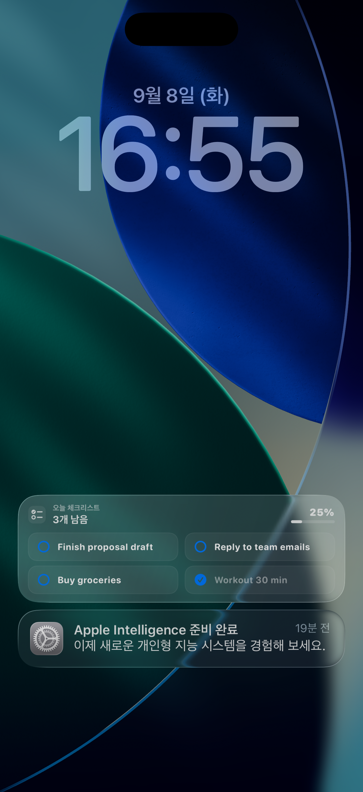
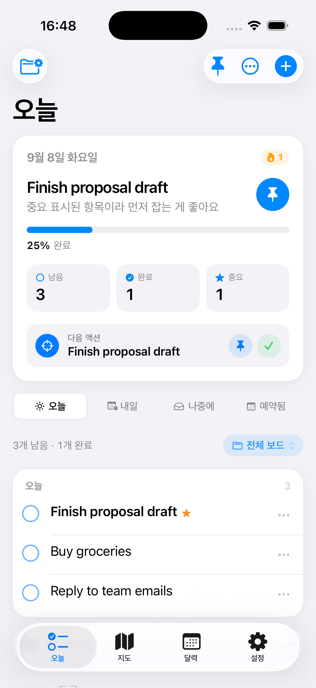
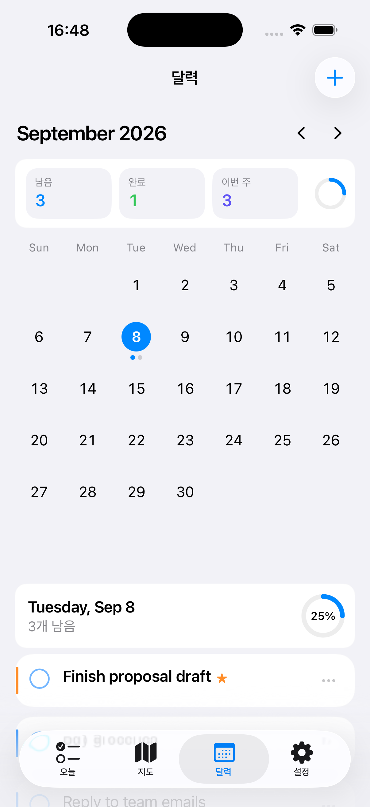
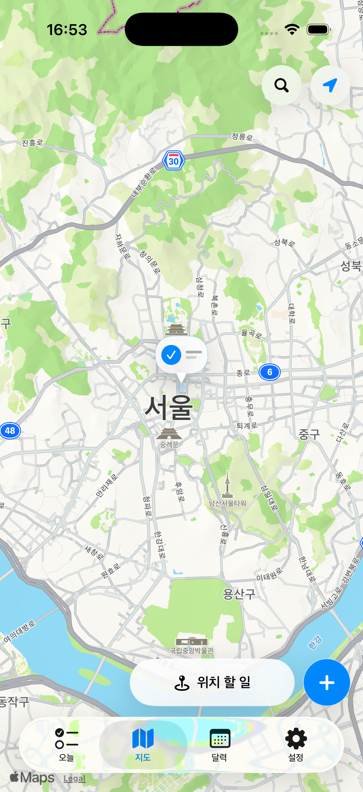
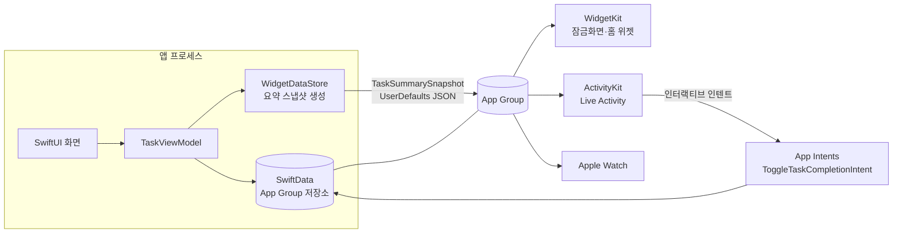

# LockTodo — 잠금화면에서 끝내는 할 일 관리

> 앱을 열지 않고 **잠금화면에서 바로** 오늘 할 일을 확인하고 체크하는 iOS 생산성 앱.
> 100% 오프라인(서버·계정·네트워킹 없음), SwiftUI + SwiftData 기반.

### ▶︎ 웹에서 바로 체험: **https://jjs111190.github.io/LockTodo/**

브라우저에서 핵심 기능(할 일 추가·완료, 잠금화면 Live Activity 동기화)을 아이폰 시뮬레이터로 체험할 수 있습니다. 설치 불필요.

<p align="center">
  
  
  
  
</p>

---

## 1. 한 줄 소개 & 해결하려는 문제

할 일 앱은 많지만, 대부분 **"앱을 열어야" 확인**할 수 있습니다. 정작 하루에 수십 번 보는 화면은 잠금화면인데 말이죠.

**LockTodo는 잠금화면 위젯 + Live Activity로 오늘 할 일을 상시 노출하고, 그 자리에서 바로 완료 체크까지** 되게 만들었습니다. 앱 실행 → 확인 → 완료로 이어지는 마찰을 없애는 것이 핵심 목표입니다.

- 서버가 없어 **완전 오프라인**으로 동작 → 개인정보 수집 0, 로그인 0
- Siri·단축어·Action Button으로 앱을 열지 않고 할 일 추가/완료
- Apple 생태계 기능(WidgetKit·ActivityKit·App Intents·Watch)을 실제로 통합

---

## 2. 주요 기능

| 영역 | 내용 |
| --- | --- |
| **잠금화면 위젯** | Inline / Circular / Rectangular 액세서리 위젯으로 남은 개수·진행률·할 일 표시, 위젯에서 바로 체크 |
| **Live Activity / 다이나믹 아일랜드** | 오늘 목록을 실시간 카드로 상시 표시, 인터랙티브 버튼으로 잠금화면에서 완료 처리 |
| **할 일 · 보드** | 오늘/내일/나중에/예약됨 분류, 보드(카테고리)별 정리, 슬라이드-투-컴플리트, 중요 표시 |
| **습관(루틴)** | 일일 습관 체크와 **연속 기록(streak)** 관리 |
| **달력** | 월간 캘린더, 세로 스크롤 시 헤더·요약이 접히고 달력이 커지는 인터랙션 |
| **지도 · 위치 알림** | 특정 장소 근처에서만 뜨는 할 일(지오펜스), 장소를 벗어나면 자동으로 사라짐 |
| **인사이트** | Swift Charts 기반 완료 추이·통계, **연속 기록 히어로** |
| **집중 타이머** | 15/25/50분 뽀모도로, 세션을 기록해 인사이트에 반영 |
| **다이어리** | 하루 마무리 회고 작성 |
| **Apple Watch** | 워치에서 오늘 요약 확인 및 완료 처리(WatchConnectivity 동기화) |
| **Siri · 단축어** | App Intents로 "할 일 추가", "오늘 목록 보기", "실시간 순찰" 등을 음성/자동화로 실행 |
| **수익화** | StoreKit 2 기반 Pro(월간·연간 구독 + 평생 해제) — 월간 인사이트·고급 잠금화면 스타일 잠금 해제 |

---

## 3. 기술 스택

- **언어/UI**: Swift, SwiftUI (iOS 17+, watchOS 9+)
- **데이터**: SwiftData (`@Model`, `@Query`, 경량 마이그레이션), App Group 공유 저장소
- **시스템 프레임워크**:
  - WidgetKit — 잠금화면 액세서리 위젯 + 홈 화면 진행률 위젯 + Control 위젯
  - ActivityKit — Live Activity / 다이나믹 아일랜드
  - App Intents — Siri·단축어·Action Button·인터랙티브 위젯 버튼
  - StoreKit 2 — 인앱 결제(구독 + 평생)
  - Swift Charts — 통계 시각화
  - CoreLocation — 위치 기반 할 일(지오펜스)
  - WatchConnectivity — iPhone ↔ Apple Watch 동기화
  - UserNotifications — 마감·위치 알림
  - BackgroundTasks — 잠금 상태에서 Live Activity·위젯 주기적 갱신
- **아키텍처**: MVVM (View / ViewModel / Model), 공용 디자인 시스템(`LockTodoDesign`·`LockTodoMotion`)

---

## 4. 아키텍처 — "어떻게 작동하는가"

이 앱의 핵심 난이도는 **앱 프로세스, 위젯 프로세스, Live Activity, 워치가 같은 데이터를 봐야 한다**는 점입니다. 서버가 없으므로 **App Group으로 공유하는 로컬 저장소**가 단일 진실 공급원(single source of truth)입니다.



**데이터 흐름 요약**
1. 사용자가 앱에서 할 일을 추가/완료하면 `TaskViewModel`이 SwiftData에 저장한다.
2. `WidgetDataStore`가 오늘 상태를 **가벼운 요약 스냅샷**(`TaskSummarySnapshot`)으로 만들어 App Group에 저장하고, 위젯·Live Activity·워치를 갱신한다.
3. 위젯/Live Activity는 **저장된 스냅샷을 그대로 믿지 않고 매 갱신마다 실데이터에서 다시 계산**한다 → 지나간 날짜·벗어난 위치의 할 일이 자동으로 사라진다.
4. 잠금화면 버튼(App Intents)으로 완료하면 백그라운드에서 SwiftData를 직접 수정하고 다시 스냅샷을 갱신한다.
5. 앱이 잠금 상태로 정지돼도, `BackgroundTasks`가 iOS가 주는 시간에 Live Activity·위젯을 주기적으로 새로고침한다. *(오프라인 앱은 푸시가 없어 초 단위 실시간은 불가 — 이 한계와 대응까지 문서화)*

---

## 5. 프로젝트 구조

```
LockTodo/
├── App/            앱 진입점, 백그라운드 갱신, 라우팅
├── Models/         SwiftData @Model (TaskItem, TaskBoard, Habit, HabitRecord, DiaryEntry, FocusSession …)
├── ViewModels/     TaskViewModel, CalendarViewModel …
├── Views/          Today, Calendar, Map, Insights, Settings, 상세/편집 화면 …
├── Components/     재사용 UI (TaskRow, SwipeActionsRow, 디자인 시스템 …)
├── Services/       WidgetDataStore, LiveActivityService, LocationReminderService,
│                   NotificationService, WatchConnectivityService, ProAccessService …
├── Intents/        App Intents (추가/완료/순찰/오늘보기) + AppShortcutsProvider
├── LiveActivity/   Live Activity Attributes + UI
├── Widgets/        잠금화면·홈·Control 위젯
└── Resources/      Info.plist, 에셋, 브랜드 아이콘
LockTodoWatch/      Apple Watch 앱
```

---

## 6. 실행 방법

> 요구: macOS + Xcode 15 이상, iOS 17 시뮬레이터(또는 실기기)

```bash
git clone <repository-url>
cd LockTodo
open LockTodo.xcodeproj
```

1. Xcode에서 스킴 **LockTodo** 선택, 대상은 **iPhone 시뮬레이터** 또는 실기기
2. 실기기 설치 시 **Signing & Capabilities**에서 본인 Team 지정, 앱·위젯·워치 타깃 모두 **App Group `group.com.jaeseok.LockTodo`** 활성화
3. ⌘R 로 실행

> 위젯/Live Activity/워치까지 함께 빌드되도록 세 타깃이 스킴에 포함되어 있습니다.

---

## 7. 기술적으로 신경 쓴 점 (어필 포인트)

- **멀티 프로세스 데이터 일관성**: App Group 공유 저장소 + 요약 스냅샷으로 앱·위젯·Live Activity·워치가 같은 상태를 본다.
- **오프라인 제약의 정직한 처리**: 서버가 없어 Live Activity를 잠금 중 초단위로 갱신할 수 없다는 한계를 인정하고, `BackgroundTasks` + 포그라운드/백그라운드 진입 시 강제 갱신으로 최대치까지 끌어올렸다.
- **자기 만료(self-expiring) 위치 로직**: 위치 기반 할 일이 장소를 벗어나거나 날짜가 지나면 위젯/Live Activity에서 자동으로 사라진다.
- **Apple 스타일 인터랙션**: 스프링 애니메이션, 슬라이드-투-컴플리트, 스크롤 반응형 헤더 등 물리 기반 모션.
- **접근성·라이트/다크**: 시스템 폰트·다이나믹 타입·색상 대응.

---

## 8. 스크린샷

| 잠금화면 Live Activity | 오늘 | 달력 | 지도 · 위치 할 일 |
| --- | --- | --- | --- |
|  |  |  |  |

### 소개 영상 (30초)

실제 앱 화면으로 만든 소개 영상: [`docs/intro.mp4`](docs/intro.mp4)
(오늘 → 달력 → 지도 → 다크 모드 → **잠금화면 위젯 · Live Activity** → 웹 체험 안내)

웹 데모( https://jjs111190.github.io/LockTodo/ ) 최상단에서 자동 재생됩니다.

> GitHub README에 영상을 인라인으로 넣으려면, 저장소 편집 화면에서 `docs/intro.mp4`를 본문에 드래그&드롭하면 자동으로 임베드됩니다.

---

## 9. 알려진 한계 / 개선 예정

- 오프라인 설계상 잠금 중 Live Activity의 **초 단위 실시간 갱신은 불가**(ActivityKit 푸시 서버 필요).
- (정리 예정) 펫 기능 제거로 **Rive 애니메이션 의존성이 현재 미사용** → 패키지 제거 예정.
